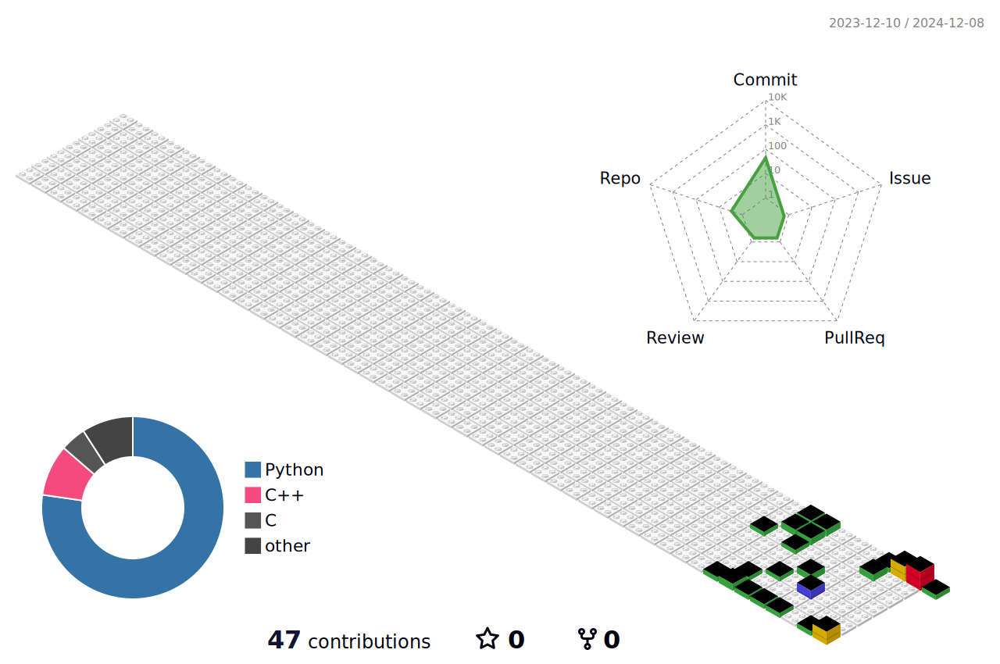

<h1 align="center">Hi, I'm Hn</h1>
<h3 align="center">a trainee dev</h3>

  

- 💬 Ask me about **C++,Python,LLM**

- 📫 How to reach me **lxnx.kiki@gmail.com**

- ⚡ Fun fact **My MBTI is ENFJ**

<h3 align="left">Connect with me:</h3>

<h3 align="left">Languages and Tools:</h3>

  
  
  
  
  
  
  
  
  
  
   
  
  
  
  
  
  

  
  
  
   
  
  
  
  
  
  
  
  
  
  

&nbsp;

<!-- 3D 잔디 이미지 -->

